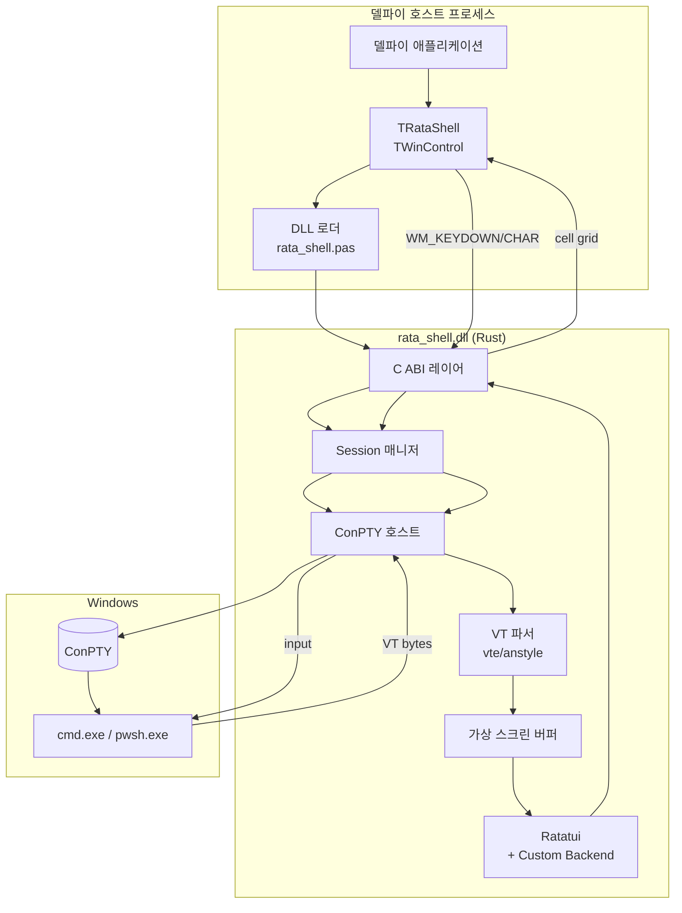

# RataShell 설계서

## 프로젝트 개요

| 항목 | 내용 |
|------|------|
| 프로젝트명 | RataShell |
| 목적 | 델파이 애플리케이션에 임베드 가능한 Windows 터미널 컴포넌트. Rust(Ratatui) DLL이 ConPTY를 통해 실제 쉘을 호스팅하고, 델파이 `TWinControl` 래퍼로 노출 |
| 대상 사용자 | 자체 IDE / 개발 도구 / 운영 콘솔에 통합 터미널을 탑재하려는 델파이 개발자 |
| 작성일 | 2026-05-04 |

## 핵심 아이디어

- **Rust DLL (`rata_shell.dll`)**: ConPTY 호스트 + VT 파서 + Ratatui 렌더러. 출력은 TUI 셀 그리드(문자 + 색상 + 속성).
- **델파이 컴포넌트 (`TRataShell`)**: `TWinControl` 자식. DLL을 동적 로드하고, 셀 그리드를 GDI/Direct2D로 페인트. 키 입력을 DLL에 포워딩.
- **렌더링 모델**: Ratatui는 일반적으로 터미널 stdout에 그리지만, 본 프로젝트는 **커스텀 Backend**를 구현해 셀 버퍼를 그대로 호스트(델파이)에 전달한다.

## 설계 문서 목차

| # | 문서 | 설명 |
|---|------|------|
| 1 | [요구사항 정의서](01-requirements.md) | 기능/비기능 요구사항 |
| 2 | [기술 스택 선정서](02-tech-stack.md) | Rust/Delphi/ConPTY/Ratatui 선택 근거 |
| 3 | [시스템 아키텍처](03-architecture.md) | 컴포넌트 구조, 스레드 모델, 데이터 흐름 |
| 4 | [FFI 인터페이스 명세](05-ffi.md) | DLL이 export하는 C ABI 함수 목록 |
| 5 | [컴포넌트/UI 설계](06-ui.md) | `TRataShell` 프로퍼티/이벤트, 입력 처리, 페인팅 |

> ERD 및 REST API 설계는 본 프로젝트의 성격상 해당 사항이 없어 생략한다.

## 시스템 개요도

## 변경 이력

| 일자 | 버전 | 작성자 | 변경 내용 |
|------|------|--------|-----------|
| 2026-05-04 | 0.1 | 초기 설계 | 최초 작성 |
