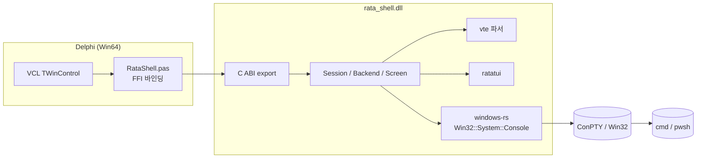

# 기술 스택 선정서

## 선정 기준

1. **임베드 적합성**: 델파이 호스트 내부에서 안전하게 동작 가능한가
2. **성능**: 터미널 입출력의 실시간성 요구 충족
3. **유지보수**: 활발한 생태계, 명확한 ABI
4. **Windows 네이티브 호환**: ConPTY와 GDI/Direct2D 통합 용이성

## 기술 스택

### DLL (Rust)

| 항목 | 선택 | 근거 |
|------|------|------|
| 언어 | **Rust 1.80+** | 메모리 안전 + zero-cost FFI. C ABI export 지원 |
| TUI 프레임워크 | **Ratatui 0.29+** | 활발히 유지되는 TUI lib. Backend trait로 출력 추상화 가능 |
| VT 파서 | **vte 0.13+** | xterm 호환 파서. 상태 기계만 제공하므로 화면 모델은 직접 구현 |
| ConPTY 바인딩 | **windows 0.59+ (windows-rs)** | Microsoft 공식. `Win32::System::Console`에 ConPTY 함수 포함 |
| 프로세스 정리 | **Job Object** (windows-rs) | 호스트 프로세스 종료 시 자식 트리 자동 종료 |
| 로깅 | **tracing + tracing-subscriber** | 옵트인 파일 로그. 디버그 빌드에서만 활성화 |
| 빌드 | **cargo + `crate-type = ["cdylib"]`** + `+crt-static` | 의존 DLL 없는 단일 파일 |
| 패닉 처리 | **`std::panic::catch_unwind`** | FFI 경계에서 unwind 차단 |

#### Ratatui 사용 방식
- 표준 `CrosstermBackend`/`TermionBackend` **사용하지 않음**
- 자체 `HostBackend` 구현 → 셀 변경을 누적 후 호스트 콜백으로 flush
- Ratatui 위젯 시스템은 활용 (향후 보더/상태바/탭 등을 위한 확장 포인트)

#### 대안 검토
| 기술 | 검토 결과 |
|------|-----------|
| C++ + FTXUI | 델파이와의 ABI 호환은 비슷하나, 메모리 안전성/패닉 격리 측면에서 Rust 우위 |
| Rust + crossterm direct | crossterm은 stdout 가정이라 임베드에 부적합 |
| ConPTY 없이 winpty | winpty는 ConPTY 등장 이후 deprecated. 신규 프로젝트에서 회피 |
| WinUI3 / WebView2 터미널 | 복잡도 과대, 델파이 폼에 임베드 시 입력 포커스/그래픽 충돌 위험 |

### 델파이 측

| 항목 | 선택 | 근거 |
|------|------|------|
| 버전 | **Delphi 13 (Studio 37.0) Win64** | 사용자 표준 환경 (인라인 var, triple-quoted string 사용 가능) |
| 컴포넌트 베이스 | **TWinControl** | 자체 HWND를 가져 키 입력/포커스/페인트 핸들링 자유로움 |
| DLL 로딩 | **동적 로드** (`LoadLibrary` + `GetProcAddress`) | DLL 미존재 시에도 IDE가 죽지 않고 디자인타임 안전 |
| 텍스트 렌더링 | **GDI (`TextOut` / `ExtTextOut`)** 1차, **Direct2D + DirectWrite** 옵션 | 1차로 GDI로 단순/안정. 고DPI/고성능 필요 시 D2D 옵션 |
| 더블 버퍼링 | 백버퍼 비트맵 → `BitBlt` | 깜빡임 제거 |
| 스레드 동기화 | `TThread.Queue` / `TThread.Synchronize` | DLL의 비동기 콜백을 메인 스레드로 마샬링 |

### 통신 / FFI

| 항목 | 선택 | 근거 |
|------|------|------|
| ABI | **C ABI (`stdcall` 또는 `cdecl`)** | Win64에서 두 규약은 사실상 동일. `cdecl` 명시 |
| 데이터 전달 | **opaque handle (`*mut c_void`)** + POD struct | 안전, ABI 안정성 |
| 콜백 | **함수 포인터 + 사용자 컨텍스트 (`*mut c_void`)** | 표준 패턴 |
| 문자열 | **UTF-8 (`*const u8` + `usize`)** | Rust 표준. 델파이는 `UTF8String`/`TBytes` 변환 |
| 셀 데이터 | **고정 크기 struct 배열** | 캐시 친화적, 마샬링 단순 |

### 빌드 / 배포

| 항목 | 선택 | 근거 |
|------|------|------|
| Rust 타깃 | `x86_64-pc-windows-msvc` | 델파이 Win64와 ABI 호환 |
| 정적 CRT | `RUSTFLAGS=-C target-feature=+crt-static` | VC 런타임 미설치 환경 지원 |
| 산출물 | `rata_shell.dll`, `rata_shell.lib`(선택), `rata_shell.h`(참고용) | DLL만 배포해도 동작 |
| 델파이 산출물 | `RataShell.pas` (FFI 바인딩), `RataShellCtrl.pas` (TWinControl), `RataShellReg.pas` (디자인타임 등록) |

## 스택 관계도

## 결정 사항 요약

- **Ratatui를 그대로 쓰지 않는다**: 표준 backend는 stdout을 점유하므로, 커스텀 `HostBackend`로 셀 그리드를 호스트에 push.
- **VT 처리는 ConPTY 출력을 다시 vte로 파싱**: ConPTY는 VT 시퀀스를 그대로 흘려 보내므로, 가상 화면을 직접 유지해야 한다.
- **렌더링 책임 분담**: Rust 측은 셀 그리드 생성까지, 픽셀 페인트는 델파이가 GDI/D2D로. → DPI/폰트/안티앨리어싱은 호스트 OS 표준에 위임.
