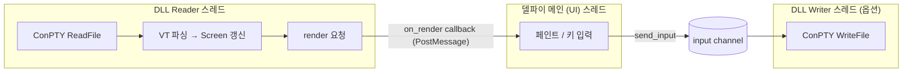
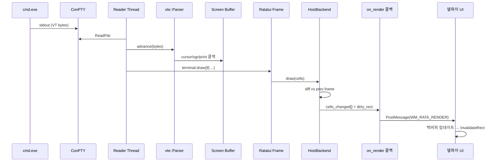
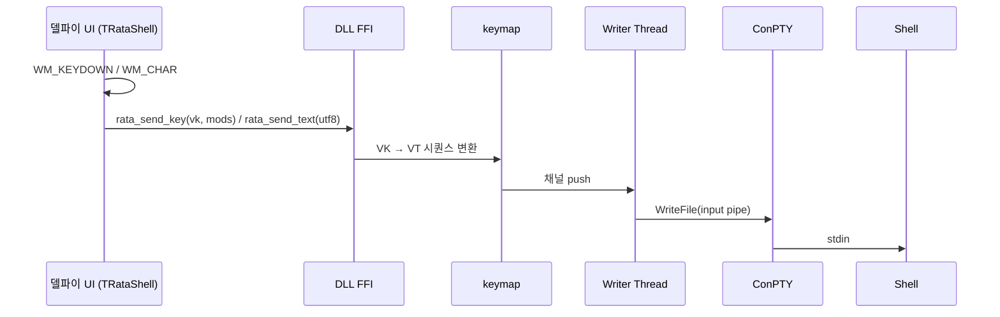
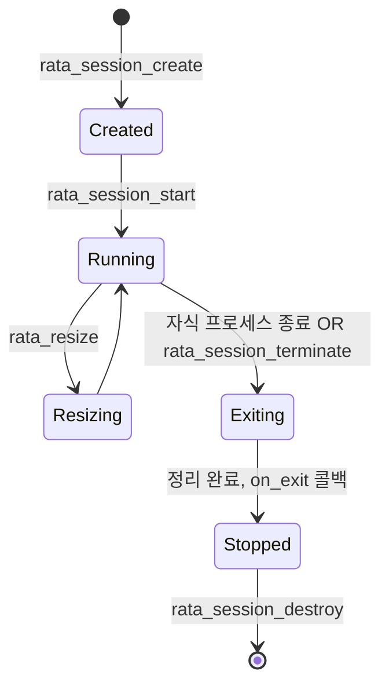
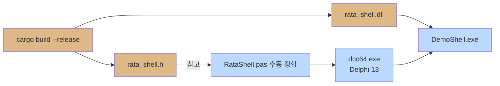

# 시스템 아키텍처

## 1. 전체 아키텍처

```mermaid
flowchart TB
    subgraph Host["델파이 호스트 (메인 스레드)"]
        Form[VCL Form]
        Ctrl[TRataShell<br/>(TWinControl)]
        Bind[RataShell.pas<br/>FFI 바인딩]
        Paint[GDI/D2D 페인터]
    end

    subgraph DllFFI["rata_shell.dll — FFI 경계"]
        Export[C ABI export 함수]
        PanicGuard[catch_unwind 가드]
    end

    subgraph Core["rata_shell.dll — Core (Rust)"]
        Sess[Session]
        Pty[PtyHost<br/>ConPTY]
        ReadT[Reader Thread]
        Parser[VT Parser<br/>(vte)]
        Screen[Screen Buffer<br/>(rows×cols)]
        Scroll[Scrollback]
        RataApp[Ratatui App<br/>+ HostBackend]
        Dirty[Dirty Tracker]
    end

    subgraph OS["Windows"]
        ConPTY[(ConPTY)]
        Job[(Job Object)]
        Shell[(cmd / pwsh)]
    end

    Form --> Ctrl --> Bind --> Export
    Export --> PanicGuard --> Sess
    Sess --> Pty
    Pty --> ConPTY
    ConPTY --> Shell
    Job -. kill on host exit .-> Shell

    Shell -- VT bytes --> ConPTY --> ReadT --> Parser --> Screen
    Screen --> RataApp --> HostBackend[HostBackend cells]
    HostBackend --> Dirty
    Dirty -- on_render callback --> Bind --> Paint --> Ctrl

    Ctrl -- WM_KEYDOWN/CHAR --> Bind --> Export --> Sess --> Pty -- write --> ConPTY --> Shell
```

## 2. 모듈 구성

### Rust DLL (`rata_shell`)

| 모듈 | 책임 |
|------|------|
| `ffi` | C ABI export, 핸들 변환, panic 가드, 콜백 디스패치 |
| `session` | 세션 라이프사이클, 자원 소유, 상태 관리 |
| `pty` | ConPTY 생성/리사이즈/종료, Job Object, 자식 프로세스 spawn |
| `io` | Reader/Writer 스레드, 채널(`crossbeam_channel`) |
| `vt` | `vte::Parser` 어댑터, SGR/커서/스크롤 명령 해석 |
| `screen` | 가상 스크린 버퍼(셀 행렬) + 스크롤백 링버퍼 |
| `render` | Ratatui `App`, 위젯 트리, `HostBackend` 구현, 디리티 트래커 |
| `palette` | 16색/256색/truecolor → RGB 매핑 |
| `keymap` | Win32 VK → VT 입력 시퀀스 변환 |

### Delphi 측

| 유닛 | 책임 |
|------|------|
| `RataShell.pas` | DLL 동적 로딩, 함수 타입/상수/구조체 정의 (FFI 바인딩) |
| `RataShell.Ctrl.pas` | `TRataShell` 컴포넌트 (`TWinControl` 자손) |
| `RataShell.Painter.pas` | 셀 그리드 → GDI 페인팅 (백버퍼 비트맵) |
| `RataShell.Reg.pas` | 디자인타임 컴포넌트 등록 (`Register`) |

## 3. 스레드 모델



### 동기화 규칙
- **세션 상태**: `Mutex<SessionInner>` 로 직렬화. 모든 export 함수 진입 시 lock.
- **Screen 갱신**: Reader 스레드만 쓰기. UI 스레드는 렌더 콜백 시점에만 읽기 (락 잠시 획득).
- **콜백 → 호스트**: 직접 호출하지 않고 `PostMessage(hwnd, WM_RATA_RENDER, ...)` 로 마샬링. 콜백에서 델파이 VCL을 직접 만지지 않는다 (다른 스레드 컨텍스트).

### Panic 격리
```rust
unsafe extern "C" fn rata_send_input(...) -> i32 {
    catch_unwind(AssertUnwindSafe(|| {
        // 실제 로직
    })).unwrap_or(RATA_ERR_PANIC)
}
```

## 4. 데이터 흐름

### 4.1 출력 (쉘 → 화면)



### 4.2 입력 (키 → 쉘)



## 5. 세션 라이프사이클



### 정리 순서 (drop)
1. 입력 채널 close → Writer 스레드 종료
2. `TerminateJobObject` → 자식 트리 종료
3. `ClosePseudoConsole` → ConPTY 닫힘 → Reader 스레드의 ReadFile이 EOF로 풀림
4. Reader/Writer 스레드 join
5. 모든 핸들 close

## 6. 화면 모델

### 셀 구조
```rust
#[repr(C)]
pub struct CellC {
    pub ch: u32,        // Unicode codepoint (0 = blank)
    pub fg: u32,        // 0xRRGGBB | 0x80000000(default flag)
    pub bg: u32,
    pub attrs: u16,     // bold/italic/underline/reverse/...
    pub width: u8,      // 1 = 일반, 2 = 동아시아 와이드, 0 = 와이드 트레일러
    pub _pad: u8,
}
```

### 좌표계
- 0-based, `(row, col)`
- 행/열 모두 `u16`로 충분 (최대 65535)

### 스크롤백
- 링버퍼 (`VecDeque<Row>`), 기본 10,000행
- `rata_scroll(delta)` 로 뷰 위치 이동
- 사용자 입력 발생 시 자동으로 최하단으로 복귀

## 7. 렌더링 파이프라인 (Ratatui 통합)

표준 Ratatui 흐름:
```
Terminal::draw(|f| { f.render_widget(...) }) → Backend::draw(cells)
```

본 프로젝트:
1. `vte` 파서가 `Screen` 의 셀들을 직접 갱신 (정전(正典) 데이터)
2. Ratatui `App::render(frame)` 가 호출됨 — 여기서 `Screen` 셀들을 위젯으로 변환하거나, 보더/상태바 등 부가 위젯을 함께 그린다
3. 렌더 결과는 `HostBackend::draw` 로 들어옴 → 이전 프레임과 diff → 변경된 셀과 영역만 호스트로 push

```mermaid
flowchart LR
    Screen[Screen<br/>(VT 결과)] --> Widget[TerminalView<br/>Ratatui Widget]
    Other[StatusBar / Border<br/>Ratatui Widget] --> Frame
    Widget --> Frame[Ratatui Frame]
    Frame --> HB[HostBackend.draw]
    HB --> Diff{이전 프레임과 비교}
    Diff -- 변경 셀 --> Push[on_render 콜백]
```

## 8. 디렉토리 구조

```
SHELL/
├── docs/
│   └── design/                  # 본 문서
├── rata_shell/                  # Rust DLL crate
│   ├── Cargo.toml
│   ├── build.rs                 # 헤더(rata_shell.h) 자동 생성 (cbindgen)
│   ├── cbindgen.toml
│   └── src/
│       ├── lib.rs               # crate root, re-export
│       ├── ffi.rs               # extern "C" 함수, panic 가드
│       ├── session.rs
│       ├── pty/
│       │   ├── mod.rs
│       │   ├── conpty.rs
│       │   └── job.rs
│       ├── io.rs
│       ├── vt.rs
│       ├── screen.rs
│       ├── render/
│       │   ├── mod.rs
│       │   ├── app.rs           # Ratatui App
│       │   └── backend.rs       # HostBackend
│       ├── palette.rs
│       └── keymap.rs
├── delphi/
│   ├── packages/
│   │   ├── RataShell_DT.dpk     # 디자인타임 패키지
│   │   └── RataShell_RT.dpk     # 런타임 패키지
│   └── src/
│       ├── RataShell.pas        # FFI 바인딩
│       ├── RataShell.Ctrl.pas   # TRataShell
│       ├── RataShell.Painter.pas
│       ├── RataShell.Reg.pas
│       └── RataShell.dcr
├── demo/
│   └── DemoShell.dproj          # 데모 폼: TRataShell 배치
└── tools/
    └── build.ps1                # cargo build + delphi compile 묶음 스크립트
```

## 9. 빌드 흐름



- DLL 산출 위치: `target/x86_64-pc-windows-msvc/release/rata_shell.dll`
- 데모 빌드 직전 PowerShell이 DLL을 `demo/Win64/Release/`로 복사

## 10. 보안/안정성 고려

| 항목 | 대응 |
|------|------|
| 임의 명령 실행 | 호스트가 명시적으로 실행할 쉘을 지정. 기본값 없음 |
| 핸들 누수 | RAII (Rust `Drop`) + Job Object 자동 정리 |
| 호스트 충돌로 자식 잔존 | Job Object `KILL_ON_JOB_CLOSE` 플래그 |
| FFI panic | `catch_unwind` + 에러 코드 반환 |
| 잘못된 핸들 | 핸들에 매직 넘버 + 글로벌 레지스트리로 검증 |
| 동시성 버그 | `Mutex` 직렬화, Send/Sync 경계 명시 |
| 한글/이모지 폭 | `unicode-width` 크레이트로 셀 너비 계산 (`width: 1|2`) |
