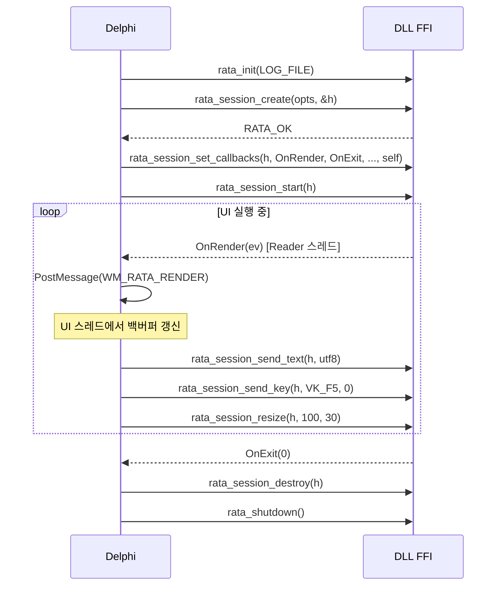

# FFI 인터페이스 명세

`rata_shell.dll`이 export하는 C ABI 함수 목록과 데이터 구조를 정의한다.
모든 함수는 `cdecl` 호출 규약, `#[no_mangle]`, panic 가드 적용.

## 1. 공통 사항

### 명명 규칙
- 함수명: `rata_<noun>_<verb>` 형식 (`rata_session_create`)
- 상수: `RATA_*` 대문자 + 언더스코어
- 핸들: opaque pointer 타입 alias (`RataSession`)

### 에러 코드
```c
typedef int32_t RataResult;

#define RATA_OK              0
#define RATA_ERR_INVALID    -1   // 잘못된 핸들 / null 포인터
#define RATA_ERR_ARG        -2   // 잘못된 인자
#define RATA_ERR_STATE      -3   // 상태 부적합 (예: 이미 종료된 세션)
#define RATA_ERR_OS         -4   // Win32 API 실패 (GetLastError로 상세)
#define RATA_ERR_IO         -5   // I/O 실패
#define RATA_ERR_PANIC     -99   // Rust panic
```

`rata_last_error_message(buf, len) -> usize` 로 마지막 에러의 설명 문자열 조회.

### 문자열 규칙
- 입력: `const char* utf8, size_t len` (널 종료 불요구)
- 출력: 호출자가 버퍼 제공, 필요한 길이를 반환. (버퍼 0 → 길이만 반환)

## 2. 라이프사이클 / 글로벌

| 함수 | 시그니처 | 설명 |
|------|----------|------|
| `rata_init` | `RataResult rata_init(uint32_t flags)` | 라이브러리 초기화. 로깅 시작 등 |
| `rata_shutdown` | `void rata_shutdown(void)` | 전역 리소스 정리 |
| `rata_version` | `const char* rata_version(void)` | 버전 문자열 (정적 수명) |
| `rata_last_error_message` | `size_t rata_last_error_message(char* buf, size_t cap)` | 마지막 에러 메시지 (UTF-8) |

`flags` 비트:
- `RATA_INIT_LOG_FILE = 0x01` — `%TEMP%\rata_shell.log` 에 로그
- `RATA_INIT_LOG_DEBUG = 0x02` — DEBUG 레벨

## 3. 세션

### 핸들
```c
typedef void* RataSession;
```

### 생성 옵션 (POD)
```c
typedef struct RataSpawnOptions {
    const char* shell_path_utf8;   size_t shell_path_len;     // 예: "C:\\Windows\\System32\\cmd.exe"
    const char* shell_args_utf8;   size_t shell_args_len;     // 명령행 (CommandLineToArgvW 형식)
    const char* cwd_utf8;          size_t cwd_len;            // null 허용
    const char* env_utf8;          size_t env_len;            // KEY=VAL\0KEY=VAL\0\0 (null이면 부모 환경 상속)
    uint16_t    cols;
    uint16_t    rows;
    uint32_t    scrollback;        // 0이면 기본값(10000)
    uint32_t    flags;             // RATA_SPAWN_*
} RataSpawnOptions;

#define RATA_SPAWN_INHERIT_CURSOR 0x01
```

### 콜백
```c
typedef void (*RataRenderCb)(void* user, const RataRenderEvent* ev);
typedef void (*RataExitCb)  (void* user, int32_t exit_code);
typedef void (*RataBellCb)  (void* user);
typedef void (*RataTitleCb) (void* user, const char* utf8, size_t len);
```

`RataRenderEvent` 는 §5 참조.

### 함수
| 함수 | 시그니처 |
|------|----------|
| 생성 | `RataResult rata_session_create(const RataSpawnOptions* opts, RataSession* out_handle)` |
| 콜백 등록 | `RataResult rata_session_set_callbacks(RataSession s, RataRenderCb on_render, RataExitCb on_exit, RataBellCb on_bell, RataTitleCb on_title, void* user)` |
| 시작 | `RataResult rata_session_start(RataSession s)` |
| 리사이즈 | `RataResult rata_session_resize(RataSession s, uint16_t cols, uint16_t rows)` |
| 입력 (텍스트) | `RataResult rata_session_send_text(RataSession s, const char* utf8, size_t len)` |
| 입력 (특수키) | `RataResult rata_session_send_key(RataSession s, uint32_t vk, uint32_t mods)` |
| 마우스 | `RataResult rata_session_send_mouse(RataSession s, RataMouseEvent ev)` |
| 스크롤백 | `RataResult rata_session_scroll(RataSession s, int32_t delta_lines)` |
| 강제 렌더 | `RataResult rata_session_request_render(RataSession s)` |
| 종료 | `RataResult rata_session_terminate(RataSession s, uint32_t timeout_ms)` |
| 파괴 | `RataResult rata_session_destroy(RataSession s)` |

### 상태 조회
| 함수 | 설명 |
|------|------|
| `rata_session_get_size(s, *cols, *rows)` | 현재 크기 |
| `rata_session_is_alive(s) -> int32_t` | 1 = 실행 중, 0 = 종료 |
| `rata_session_get_title(s, buf, cap) -> usize` | 현재 타이틀 (`OSC 0/2`) |
| `rata_session_copy_selection(s, buf, cap) -> usize` | 선택 영역 텍스트 |

## 4. 키 매핑 (`mods`)

```c
#define RATA_MOD_SHIFT  0x01
#define RATA_MOD_CTRL   0x02
#define RATA_MOD_ALT    0x04
#define RATA_MOD_WIN    0x08
```

`vk`는 Win32 Virtual-Key Code(`VK_RETURN`, `VK_F1` 등)를 그대로 사용. 일반 문자는 `rata_session_send_text`로 보낸다 (IME 합성 결과 포함).

## 5. 렌더 이벤트

```c
typedef struct RataRect {
    uint16_t x, y, w, h;
} RataRect;

typedef struct RataCell {
    uint32_t ch;     // unicode codepoint (0 = blank)
    uint32_t fg;     // 0xAARRGGBB; A=0xFF normal, A=0x00 default-color
    uint32_t bg;
    uint16_t attrs;  // RATA_ATTR_* bitmask
    uint8_t  width;  // 1 or 2 (and 0 = wide trailer)
    uint8_t  _pad;
} RataCell;

#define RATA_ATTR_BOLD       0x0001
#define RATA_ATTR_DIM        0x0002
#define RATA_ATTR_ITALIC     0x0004
#define RATA_ATTR_UNDERLINE  0x0008
#define RATA_ATTR_BLINK      0x0010
#define RATA_ATTR_REVERSE    0x0020
#define RATA_ATTR_HIDDEN     0x0040
#define RATA_ATTR_STRIKE     0x0080

typedef struct RataRenderEvent {
    uint16_t cols;
    uint16_t rows;
    uint16_t cursor_x;
    uint16_t cursor_y;
    uint8_t  cursor_visible;
    uint8_t  cursor_style;       // 0=block,1=underline,2=bar
    uint8_t  _pad[2];

    const RataRect* dirty_rects; // 영역 배열 (대부분 1~2개)
    size_t          dirty_count;

    const RataCell* cells;       // 길이 = cols*rows (전체 그리드 스냅샷)
    size_t          cells_len;
} RataRenderEvent;
```

> 메모리 수명: 콜백 동안에만 유효. 호스트는 콜백 내에서 복사 (또는 락 잡고 처리).
> 콜백 호출 컨텍스트는 **DLL Reader 스레드**. 호스트는 즉시 `PostMessage`로 UI 스레드로 마샬링.

## 6. 마우스 이벤트

```c
typedef enum {
    RATA_MOUSE_DOWN = 0,
    RATA_MOUSE_UP   = 1,
    RATA_MOUSE_MOVE = 2,
    RATA_MOUSE_WHEEL= 3,
} RataMouseKind;

typedef struct RataMouseEvent {
    uint8_t  kind;
    uint8_t  button;     // 0=left,1=middle,2=right
    uint16_t mods;
    uint16_t col;
    uint16_t row;
    int16_t  wheel;      // RATA_MOUSE_WHEEL 일 때만
} RataMouseEvent;
```

## 7. 호출 시퀀스 예시



## 8. 델파이 측 바인딩 스케치

```pascal
// RataShell.pas (요약)
type
  TRataResult = Integer;
  TRataSession = Pointer;

  TRataCell = record
    Ch: UInt32;
    Fg, Bg: UInt32;
    Attrs: UInt16;
    Width, Pad: Byte;
  end;
  PRataCell = ^TRataCell;

  TRataRect = record
    X, Y, W, H: UInt16;
  end;
  PRataRect = ^TRataRect;

  TRataRenderEvent = record
    Cols, Rows: UInt16;
    CursorX, CursorY: UInt16;
    CursorVisible, CursorStyle: Byte;
    Pad: array[0..1] of Byte;
    DirtyRects: PRataRect;
    DirtyCount: NativeUInt;
    Cells: PRataCell;
    CellsLen: NativeUInt;
  end;
  PRataRenderEvent = ^TRataRenderEvent;

  TRataRenderCb = procedure(AUser: Pointer; const AEvent: PRataRenderEvent); cdecl;
  TRataExitCb   = procedure(AUser: Pointer; AExitCode: Integer); cdecl;

var
  rata_session_create: function(const AOpts: PRataSpawnOptions;
    out AHandle: TRataSession): TRataResult; cdecl;
  // ... 나머지 함수 포인터들
```

## 9. 헤더 자동 생성

`cbindgen` 으로 `rata_shell.h` 를 빌드 시 자동 생성하고, 델파이 `RataShell.pas` 는 수기로 동기화 (정합성 검증을 위해 헤더와 비교하는 PowerShell 스크립트 옵션).

## 10. 호환성/버전

- `rata_version()` 은 `"0.1.0"` 같은 SemVer 문자열
- minor 증가 시 add-only ABI (기존 함수/구조체 시그니처 변경 금지)
- 구조체 끝 `_pad` 필드는 향후 확장 슬롯
