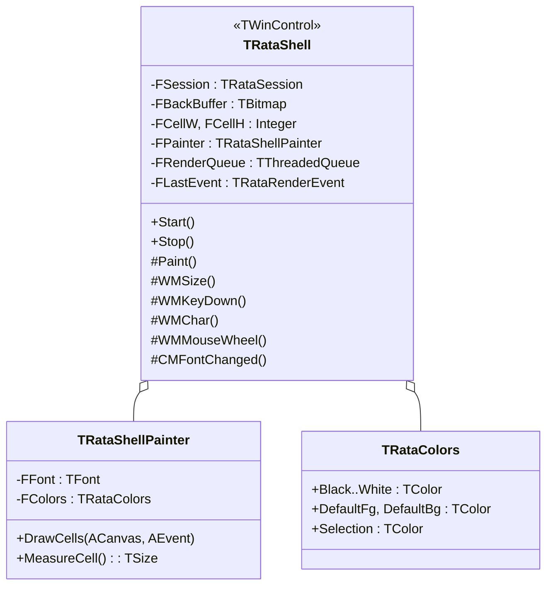
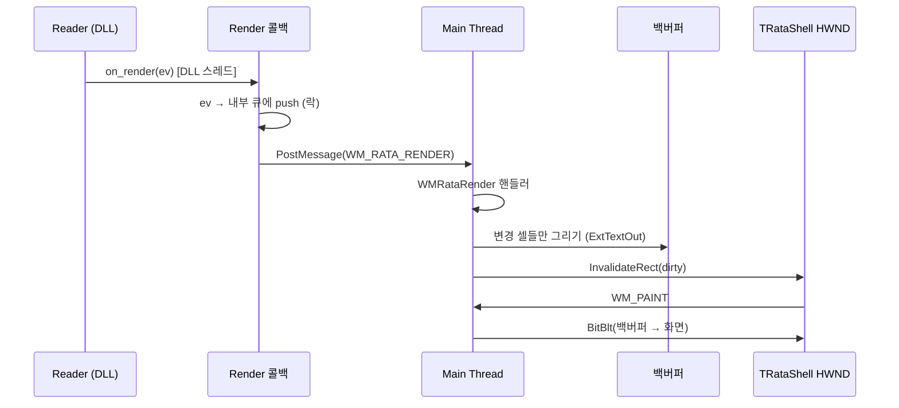
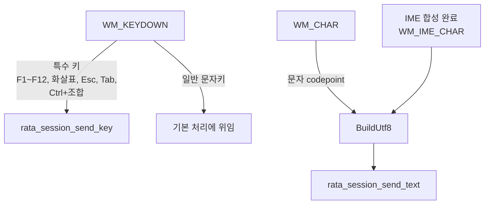
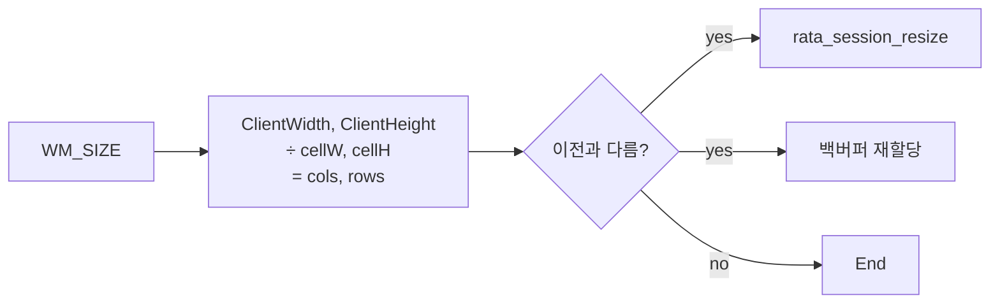
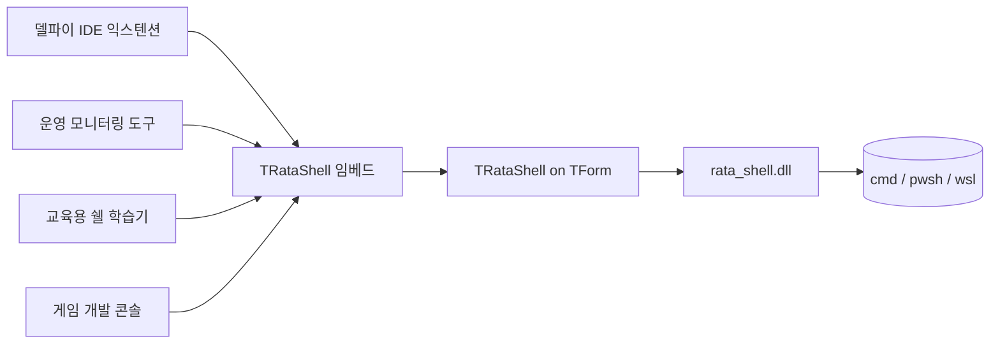

# 컴포넌트 / UI 설계 (`TRataShell`)

본 문서는 델파이 측 컴포넌트 `TRataShell`의 표면(프로퍼티/이벤트/메서드)과 내부 페인팅·입력 처리 흐름을 정의한다. 일반적 화면 설계서(페이지 단위)와 달리 단일 VCL 컴포넌트의 설계서이다.

## 1. 컴포넌트 개요

| 항목 | 내용 |
|------|------|
| 이름 | `TRataShell` |
| 베이스 | `Vcl.Controls.TWinControl` |
| 패키지 | `RataShell_RT.dpk` (런타임), `RataShell_DT.dpk` (디자인타임 등록) |
| 팔레트 카테고리 | `RataShell` |
| 라이선스 표기 | 컴포넌트 About (디자인타임) |

## 2. 컴포넌트 외형 (디자인타임)

```
+--------------------------------------------+
| TRataShell (디자인타임 시안)              |
| ┌────────────────────────────────────────┐|
| │ Microsoft Windows [Version 10.0.26200] │|
| │ (c) Microsoft Corporation.             │|
| │                                        │|
| │ C:\>_                                  │|
| │                                        │|
| └────────────────────────────────────────┘|
+--------------------------------------------+
```

런타임에는 ConPTY가 실행 중인 실제 쉘 화면이 그려진다. 디자인타임에서는 정적 placeholder를 그려서 "어디 배치되는지"만 표시.

## 3. Public 프로퍼티

| 프로퍼티 | 타입 | 기본값 | 설명 |
|----------|------|--------|------|
| `ShellPath` | `string` | `''` (공백 시 `cmd.exe`) | 실행할 쉘 실행 파일 경로 |
| `ShellArgs` | `string` | `''` | 쉘 인자 |
| `WorkingDir` | `string` | `''` (현재 디렉터리) | 자식 프로세스 cwd |
| `Environment` | `TStrings` | 빈 리스트 | `KEY=VALUE` 항목. 비어 있으면 부모 환경 상속 |
| `AutoStart` | `Boolean` | `False` | True면 `Loaded` 시 자동 시작 |
| `Active` | `Boolean` | `False` | True 설정 시 시작, False 설정 시 종료 |
| `ScrollbackLines` | `Integer` | `10000` | 0이면 비활성화 |
| `Font` | `TFont` | Cascadia Mono 10pt | 모노스페이스 권장 |
| `Colors` | `TRataColors` | xterm 16색 | 16색 + 기본 fg/bg |
| `CursorStyle` | `(csBlock, csUnderline, csBar)` | `csBlock` | 커서 모양 |
| `CursorBlink` | `Boolean` | `True` | 커서 깜빡임 |
| `BorderStyle` | `(bsNone, bsSingle)` | `bsSingle` | 컴포넌트 테두리 |
| `ReadOnly` | `Boolean` | `False` | 입력 차단 (로그 뷰어 용도) |

### 읽기 전용 프로퍼티
| 프로퍼티 | 타입 | 설명 |
|----------|------|------|
| `Cols` | `Integer` | 현재 열 수 |
| `Rows` | `Integer` | 현재 행 수 |
| `IsAlive` | `Boolean` | 자식 프로세스 실행 여부 |
| `Title` | `string` | OSC 0/2 로 보고된 타이틀 |

## 4. 이벤트

| 이벤트 | 시그니처 | 설명 |
|--------|----------|------|
| `OnStarted` | `TNotifyEvent` | 쉘 시작 직후 |
| `OnExit` | `procedure(Sender: TObject; AExitCode: Integer) of object` | 자식 프로세스 종료 |
| `OnTitleChange` | `procedure(Sender: TObject; const ATitle: string) of object` | 타이틀 변경 |
| `OnBell` | `TNotifyEvent` | BEL 수신 |
| `OnRender` | `TNotifyEvent` | 매 렌더 후 (퍼포먼스 측정/디버깅용, 보통 미사용) |
| `OnSelectionChange` | `TNotifyEvent` | 선택 영역 변경 |

## 5. Public 메서드

```pascal
procedure Start;
procedure Stop(ATimeoutMs: Cardinal = 2000);
procedure Restart;
procedure SendText(const AText: string);          // UTF-16 → UTF-8 변환 후 DLL로
procedure SendKey(AVK: Word; AMods: Word);
procedure ScrollBy(ALineDelta: Integer);
procedure ScrollToBottom;
procedure CopySelection;                          // 클립보드로
procedure Paste;                                  // 클립보드에서
function  GetText(ARow1, ARow2: Integer): string; // 스크롤백 추출
```

## 6. 내부 구조



## 7. 페인팅 흐름



### 페인팅 규칙
1. **백버퍼**: 컴포넌트 크기 변경 시 재할당. 항상 `cols * cellW`, `rows * cellH` 픽셀.
2. **셀 단위 그리기**: 동일 속성(fg/bg/attrs)이 연속된 셀은 한 번의 `ExtTextOut`으로 묶음 (런 단위).
3. **커서**: 별도 페인트 패스. 깜빡임은 `TTimer` (250 ms)로 토글.
4. **선택**: 선택 영역 셀은 `RATA_ATTR_REVERSE` 가산 후 그리기.
5. **DPI**: `Font.Height`를 픽셀 기준으로 사용. 모니터 DPI 변경 시 `CMDpiChanged` 처리.

## 8. 키 입력 흐름



### 매핑 테이블 (예)

| Win32 VK | Mods | DLL로 전달 |
|----------|------|------------|
| `VK_RETURN` | - | send_key(13, 0) → DLL이 `\r` 변환 |
| `VK_TAB` | - | send_key(9, 0) |
| `VK_LEFT` | - | send_key(VK_LEFT, 0) → DLL이 `ESC[D` 변환 |
| `VK_LEFT` | Ctrl | `ESC[1;5D` |
| `VK_F5` | - | `ESC[15~` |
| `'C'` | Ctrl | 선택 영역 있으면 복사, 없으면 `\x03` |
| `'V'` | Ctrl+Shift | Paste |
| `VK_INSERT` | Shift | Paste |

> 실제 시퀀스는 DLL의 `keymap.rs`에서 결정. 델파이는 vk와 mods만 전달.

## 9. 마우스 / 선택

- **드래그 선택**: 좌클릭 down → move → up. 셀 좌표로 anchor/end 보관.
- **단어 선택**: 더블클릭 (단어 경계는 DLL에 위임)
- **줄 선택**: 트리플클릭
- **컨텍스트 메뉴**: 우클릭으로 Copy/Paste/Clear/Properties 표시 (옵션)
- **휠 스크롤**: `WM_MOUSEWHEEL` → `rata_session_scroll(±3)`

## 10. 리사이즈



폰트 변경 시 (`CMFontChanged`) 셀 크기 재측정 후 동일 흐름.

## 11. 디자인타임

```pascal
// RataShell.Reg.pas
procedure Register;
begin
  RegisterComponents('RataShell', [TRataShell]);
  RegisterPropertyEditor(TypeInfo(string), TRataShell, 'ShellPath',
    TRataShellPathProperty);
end;
```

- `TRataShellPathProperty`: `paDialog`, 파일 다이얼로그로 `.exe` 선택
- 컴포넌트 아이콘: `RataShell.dcr`

## 12. 데모 폼

```
+----------------------------------------------------+
| File  Shell  Help                                  |
+----------------------------------------------------+
| [ ▶ Start ]  [ ■ Stop ]  Shell:[cmd.exe ▼]        |
+----------------------------------------------------+
| TRataShell — Align: alClient                       |
|                                                    |
|                                                    |
|                                                    |
|                                                    |
|                                                    |
+----------------------------------------------------+
| Status: Running   PID: 1234   80×25                |
+----------------------------------------------------+
```

데모는 `demo/DemoShell.dproj`. 핵심 코드:

```pascal
procedure TFormMain.btnStartClick(Sender: TObject);
begin
  RataShell1.ShellPath := comboShell.Text;
  RataShell1.Start;
end;
```

## 13. 사용 시나리오



## 14. 향후 확장 (out of scope, 메모)

- 탭/분할 화면 (mux)
- ssh/serial 등 비-ConPTY 백엔드
- Direct2D 페인터 (저DPI에서 GDI, 고DPI/고성능에서 D2D 자동 선택)
- 로그 뷰어 모드 (입력 차단 + 검색/필터)
- 검색 (`Ctrl+F`) — 스크롤백 정규식 검색
